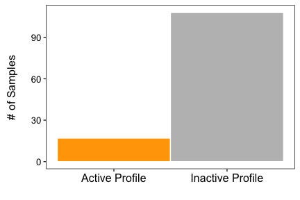

<!--
%\VignetteEngine{rmarkdown::render}
%\VignetteIndexEntry{SISPA:Method for Sample Integrated Set Profile Analysis}
-->
  
SISPA: A Method for Sample Integrated Set Profile Analysis
=====================================================================================================
###Bhakti Dwivedi and Jeanne Kowalski  
Winship Cancer Institute, Emory University, Atlanta, 30322, USA  
  
###Introduction  
Sample Integrated Set Profile Analysis (SISPA) is a method designed to define sample groups using a defined gene set with similar, a priori defined molecular profile (Kowalski et al., 2016). SISPA can perform either a single- or two-feature analysis. We defined a feature as a specific data type (e.g., expression, methylation, variant, or copy change data) and profile is a genomic change of either increase (up) or decrease (down) within a feature. 

Here the user specifies gene set by sample molecular data (expression, methylation, variant, or copy change data) and profile of interest to obtain gene set enrichment scores for each sample. The enrichment scores for each sample, overall genes, are computed using the zscore method implemented in the GSVA R package (Hanzelmann, Castelo, and Guinney 2013). When multiple data types are considered, a composite zscore is computed between features by adding or substracting individual zscores between features for each gene set depending on their corrosponding profile. The sample profile zscores are rank ordered by the desired change or profile. A change point model (Killick and Eckley 2014, Killick, Hayens, and Eckley 2015) is then applied to the sample zscores to identify groups of samples that show similar gene set profile. Users can select changes in mean (cpt.mean), variance (cpt.var) or both (cpt.meanvar) from the available methods (AMOC, PELT, SegNeigh, BinSeg) for changepoint identification in the data set using the default settings. Samples that satisfy the desired gene set profile are grouped into samples with profile activity, while samples that do not satisfy the profile of interest are grouped as samples without profile activity. 

SISPA requires a minimum of 10 samples and one gene to compute sample profile zscores. If the number of input genes is less than 3, a standard zscore is computed for each gene instead of GSVA enrichment zscore, which is added across all genes. When multiple The individual zscores are added over the genes to estimate the sample enrichment score. Figure 1 shows the schematic representation of the SISPA method overview.   
  

  
The package incorporates two example datasets: RNA-seq derived gene expression and Exome-seq derived variant change data from patients with multiple myeloma (https://research.themmrf.org/). The datasets (ExpressionSet, VariantSet) are provided as a GeneSetCollection object called SISPA_data in the SISPA package. These datasets can be loaded as follows:  
  

```r
library("SISPA")
load("data.rda")
ExpressionSet[1:5,1:5]
```

```
##       gene MMRF_1024_1_BM MMRF_1184_1_BM MMRF_1293_1_BM MMRF_1423_1_BM
## 1    ABCA1       6.788471       8.253512      10.269220      11.133477
## 2     ATF5      12.051511       9.401691      11.336297      11.714614
## 3    DPP10       0.000000       0.000000       0.000000       0.000000
## 4    FGFR3       5.148248       5.715777       6.041186       4.684431
## 5 HLA-DRB5       8.960737       5.087280       6.096927       1.698950
```
  
Input data set must be a data frame with rows representing genes (or other forms of gene ids) and columns representing samples. Please see example datasets (e.g., ExpressionSet, VariantSet) provided with the package.

###SISPA: One-Feature Analysis
SISPA one-feature (one data type) analysis expects one input data set or data type to identify sample groups on. The input data set consists of more than two samples with one more number of genes. Genes with zero variance across the samples are excluded from the analysis. An example of single-feature analysis could be identifying samples with increased or decreased expression profile within the defined gene set. Users can specify the expected sample profile change for the given data type or feature using 'f1.profile'. Samples with increased profile activity are obtained by specifying sample profile to "up", while samples with decreased profile activity scores are obtained by specifying sample profile to "down". Here, we illustrate the use of SISPA one-feature analysis using gene expression data set comprised of 6 genes and 125 patient samples to obtain samples with increased profile activity within the gene set. A changepoint plot is also generated, representing samples sorted from the smallest (least desirable) to largest (most desirable) profile scores by their identified changepoints according to those that satisfy the profile most (change point 1; above orange dotted line), next most (change point 2 or greater; above grey dotted lines) and so forth (Figure 2).  
  
  

```r
sampleScores <- SISPA(feature=1,f1.df=ExpressionSet,f1.profile="up")
```


```r
head(sampleScores)
```

```
##           samples   zscore changepoints sample_groups
## 10 MMRF_1584_1_BM 3.359849            1             1
## 37 MMRF_1664_1_BM 3.165591            1             1
## 13 MMRF_1613_1_BM 2.698932            1             1
## 82 MMRF_1785_1_BM 2.406956            1             1
## 97 MMRF_1822_1_BM 2.359366            1             1
## 61 MMRF_1721_1_BM 1.982967            1             1
```

Additional diagnostic plots can be generated for easy visualization of samples by their profile activity scores. Waterfall plot represents sample profile zscores sorted from the smallest to largest profile scores Samples with profile activity are shown with orange-filled bars, while samples without the profile activity are shown with grey-filled bars. Regardless of the sample profile (up or down), samples with profile activity are the samples with the increased SISPA profile scores.  

 

```r
waterfallplot(sampleScores)
```


  
Frequency distribution of the number of samples identified with (orange) and without (grey) the profile activity.  

```r
freqplot(sampleScores)
```


  

###SISPA: Two-Feature Analysis
SISPA two-feature (two data type) analysis expects two input data sets or data types to identify sample groups. Each input data set consists of more than two samples with one more number of genes. The two data sets should have the same number of samples (columns); however, the number of genes or the number of gene variants (rows) may vary. Genes with zero variance across the samples within each data type are excluded from the analysis. An example of two-feature analysis could be identifying samples with increased gene expression and increased copy change within the defined gene sets. Users can specify the expected sample profile change by each feature using f1.profile and f2.profile. Samples with increased profile activity are obtained by specifying sample profile to "up", while samples with decreased profile activity scores are obtained by specifying sample profile to "down". Profile changes are input for each data type separately. Here, we illustrate the use of SISPA two-feature analysis using gene expression data set comprised of 6 genes and 125 patient samples and variant change data set comprised of 301 gene variants on the same 125 patient samples to obtain samples with both increased gene expression and increased variant changes.    
  
  

```r
sampleScores <- SISPA(feature=2,f1.df=ExpressionSet,f1.profile="up",
                                f2.df=VariantSet,f2.profile="up")
```


```r
head(sampleScores)
```

```
##            samples    zscore changepoints sample_groups
## 40  MMRF_1670_1_BM 11.552058            1             1
## 61  MMRF_1721_1_BM 11.365529            1             1
## 50  MMRF_1700_1_BM 11.209544            1             1
## 101 MMRF_1831_1_BM 10.499662            1             1
## 124 MMRF_1893_1_BM 10.104307            1             1
## 54  MMRF_1713_1_BM  9.664439            1             1
```

As with one-feature analysis, waterfall plot and frequency bar plot can be generated for easy visualization of sample groups.

```r
waterfallplot(sampleScores)
```


  

```r
freqplot(sampleScores)
```


