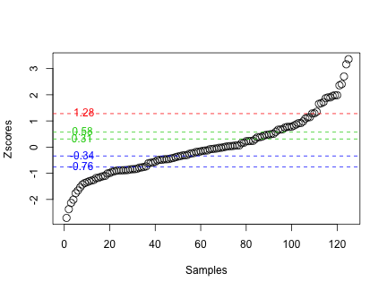
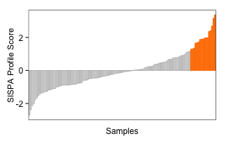
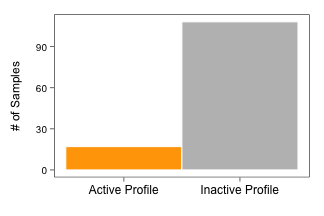
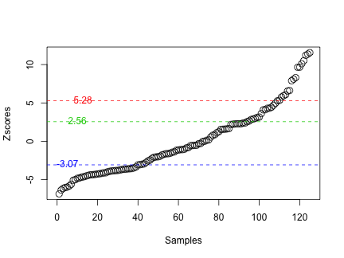
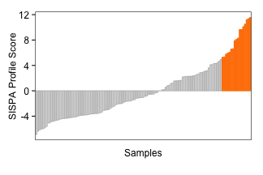

<!--
%\VignetteEngine{knitr::knitr}
%\VignetteIndexEntry{SISPA:Method for Sample Integrated Set Profile Analysis}
-->
  
SISPA: Method for Sample Integrated Set Profile Analysis
=====================================================================================================
###Bhakti Dwivedi and Jeanne Kowalski  
Winship Cancer Institute, Emory University, Atlanta, 30322, USA  
  
###Introduction  
Sample Integrated Gene Set Analysis (SISPA) is a method designed to define sample groups with similar gene set enrichment profiles. The user specifies list of candidate genes and samples by molecular data (expression, methylation, variant, or copy change data) to obtain gene set enrichment scores by each sample. The enrichment scores for each sample are computed using the zscore method implemented in the GSVA R package[ref]. The score statistics is rank ordered by the desired profile (e.g., upregulated or downregulated) for each sample. A change point model is then applied to the sample scores to identify groups of samples that show similar gene set profile patterns. Samples are ranked by desired profile activity score and grouped by samples with and without profile activity. SISPA requires a minimum of 3 samples to compute gene set enrichment scores. If the number of input genes is less than 3, a standard zscore is computed for each gene instead of GSVA enrichment zscore. The individual zscores are added over the genes to estimate the sample enrichment score. Figure 1 shows the schematic representation of the SISPA method overview.   
  

  
The package incorporates two datasets: RNA-seq derived gene expression and variant change data from patients with mulitple myeloma. The datasets (ExpressionSet, VariantSet) on sample gene set (GeneSet, VariantGeneSet) are provided as a GeneSetCollection object called SISPA_data in the SISPA package in addition to any other data used in this vignette. These dataets can be loaded as follows:  
  

```r
library("SISPA")
load("SISPA_data.Rda")
```
  
  
\newpage

###SISPA: One Feature Analysis
SISPA, one feature (od data type) analysis expects one input data set to estimate the profile on. The input data set consists of more than two samples with one more number of genes. Genes with constant values throughout the samples are discarded. Users can specify the expected sample profile pattern for the given feature using f1.profile. Samples with increased profile activity scores are obtained using profile "up", while samples with decreased profile activity scores are obtained using profile"down". Here, we illustrate the use of sample profile identification with increased profile activity using gene expression dataset. The function also generates plot to assess the distribution of zscores with the identfied changepoints across samples (Figure 2).  
  
  

```r
sampleScores <- SISPA(feature=1,f1.df=ExpressionSet,f1.genes=GeneSet,f1.profile="up")
```

 

```r
head(sampleScores)
```

```
##           samples   zscore changepoints sample_groups
## 10 MMRF_1584_1_BM 3.359849            1             1
## 37 MMRF_1664_1_BM 3.165591            1             1
## 13 MMRF_1613_1_BM 2.698932            1             1
## 82 MMRF_1785_1_BM 2.406956            1             1
## 97 MMRF_1822_1_BM 2.359366            1             1
## 61 MMRF_1721_1_BM 1.982967            1             1
```

The waterfallplot and freqplot can be drawn for easy visualization of samples by their profile activity scores. Samples with profile activity are highlighted in orange, while samples without profile activity are highlighted in grey. Regardless of the user-selected sample profile pattern, samples with profile activity are the samples with the increased SISPA profile score or zscores. 
\newpage  

```r
waterfallplot(sampleScores)
```

 
  
  

```r
freqplot(sampleScores)
```

 
  
\newpage

###SISPA: Two Feature Analysis
SISPA two feature (or data type) analysis expects the same number of samples (columns) across the input data sets, the number of genes or the number of gene variants (rows) may vary. Genes with constant values throughout the samples within a data type are discarded. Users can specify the expected sample profile pattern by each feature using f1.profile and f2.profile. Samples with increased profile activity scores are obtained using profile"up", while samples with decreased profile activity scores are obtained using profile"down". Here, we illustrate the use of sample profile identification with increased profile activity using both the gene expression and gene variant data.    
  

```r
sampleScores <- SISPA(feature=2,f1.df=ExpressionSet,f1.genes=GeneSet,f1.profile="up",
                      f2.df=VariantSet,f2.genes=VariantGeneSet,f2.profile="up")
```

 

```r
head(sampleScores)
```

```
##            samples    zscore changepoints sample_groups
## 40  MMRF_1670_1_BM 11.552058            1             1
## 61  MMRF_1721_1_BM 11.365529            1             1
## 50  MMRF_1700_1_BM 11.209544            1             1
## 101 MMRF_1831_1_BM 10.499662            1             1
## 124 MMRF_1893_1_BM 10.104307            1             1
## 54  MMRF_1713_1_BM  9.664439            1             1
```

The waterfallplot and freqplot can be drawn for easy visualization of samples by their profile activity scores. Samples with profile activity are highlighted in orange, while samples without profile activity are highlighted in grey. Regardless of the user-selected sample profile pattern, samples with profile activity are the samples with the increased SISPA profile score or zscores.
\newpage  

```r
waterfallplot(sampleScores)
```

 
  

```r
freqplot(sampleScores)
```

 

