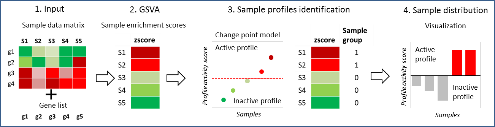

<!--
%\VignetteEngine{knitr::knitr}
%\VignetteIndexEntry{replace me with the vignette title}
-->

<center> <h4>SISPA: Method for Sample Integrated Set Profile Analysis</h4> </center>
===========================================================================================================
<center> <h5>Bhakti Dwivedi, Ph.D and Jeanne Kowalski, Ph.D </h5></center>
<center> Winship Cancer Institute, Emory University, Atlanta, 30322, USA</center>

###Introduction
Sample Integrated Gene Set Analysis (SISPA) is a method designed to define sample groups with similar gene set enrichment profiles. The user specifies a gene list of interest and sample by gene molecular data (expression, methylation, variant, or copy change data) to obtain gene set enrichment scores by each sample. The score statistics is rank ordered by the desired profile (e.g., upregulated or downregulated) for samples. A change point model is then applied to the sample scores to identify groups of samples that show similar gene set profile patterns. Samples are ranked by desired profile activity score and grouped by samples with and without profile activity. Figure 1 shows the schematic representation of the SISPA method overview.



<center> <h6>Figure 1: SISPA method overview</h6></center>

###1. Data preparation
Here, we will consider an example RNA-seq expression data set to illustrate the applications of SISPA. The data set consists of 125 patients with myeloma on 8 genes total. This data ExpressionSet on sample gene set GeneSet. is provided as a GeneSetCollection object called SISPAData in the SISPA package in addition to other data used in this vignette. These data can be loaded as follows:


```r
library("SISPA")
load("SISPA_data.Rda")
```

We also need to load the following additional libraries:

```r
library(GSVA)
library(changepoint)
library(data.table)
library(plyr)
library(ggplot2)
```

###2. Sample enrichment scores
We start with the estimation of GSVA enrichment scores with RNA-seq expression data over the genes using gsva() function from the GSVA package. The GSVA enrichment is performed using \verb+zscore+ zscore method per sample. All default settings as in gsva() function are being used in this method.


```r
gsva_results <- callGSVA(ExpressionSet,GeneSet)
head(gsva_results)
```

```
##          samples             zscore
## 1 MMRF_1024_1_BM   -1.2934198087292
## 2 MMRF_1184_1_BM -0.574168456463967
## 3 MMRF_1293_1_BM 0.0237206751195218
## 4 MMRF_1423_1_BM -0.184499176095945
## 5 MMRF_1512_1_BM -0.474315699575971
## 6 MMRF_1520_1_BM  -1.55127671958796
```


###3. Sample profile identification
We then apply the changepoint model to the gene set GSVA enrichment zscores by samples (or profile activity scores) produced from the callGSVA function to assese different sample groups. We use multiple changepoint algorithm, Binary Segmentation ("BinSeg") with upto 60 maximum number of changepoint to search for using the changes in variance. Users can look at the changepoint documentation for the choice of method supplied (single or multiple changepoints) in addition to the maximum number of changepoints allowed and type of data (changes in mean or variance). Users can specify the expected sample profile pattern with the parameter \ver+dir+. Samples with increased profile activity scores are obtained using dir="up", while samples with decreased profile activity scores are obtained using dir="down". We illustrate the use of sample profile identification with increased profile activity.


```r
cpt_on_samples <- cptSamples(gsva_results,dir="up",cpt_data="var",cpt_method="BinSeg",cpt_max=60)
```
<center></center>
<center><h6>Figure 2:  Plot of the ExpressionSet zscores with the identified changepoints for the underlying variance</h6></center>
<br></br>


```r
head(cpt_on_samples)
```

```
##           samples   zscore changepoints sample_groups
## 13 MMRF_1613_1_BM 3.378475            1             1
## 10 MMRF_1584_1_BM 2.927757            1             1
## 98 MMRF_1823_1_BM 2.900674            1             1
## 46 MMRF_1683_1_BM 2.867514            1             1
## 21 MMRF_1630_1_BM 2.830496            1             1
## 97 MMRF_1822_1_BM 2.611923            1             1
```

###4. Sample profile distribution
The waterfallplot and freqplot function allows easy visualization of samples by their profile activity scores.

```r
waterfallplot(cpt_on_samples)
```
<center></center>
<center><h6>Figure 3:  Waterfall plot of the ExpressionSet zscores for samples with (orange) and without profile activity (grey)</h6></center>
<br></br>


```r
freqplot(cpt_on_samples)
```
<center></center>
<center><h6>Figure 3:  Bar plot distribution of samples with (orange) and without profile activity (grey)</h6></center>
